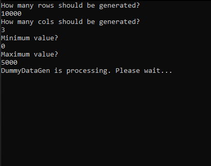

# vktDummyDataGenerator

A little Python script that generates random dummy-databases as .txt files. Works either as standalone or can be imported into other projects.

As for the current version, only integers can be generated.

<h2>Usage</h2>
<ul>
    <li>As standalone:
        <ul>
            <li>Open "vktDummyDataGenerator.py" in a Terminal. It will open up a wizard guide.</li>
            <li>After answering its questions, the database will be generated as "DataOutput.txt", ready to be used in other general projects.</li>
        </ul>
    </li>
    <li>As import in other Python scripts:
        <ul>
            <li><code>Import vktDummyDataGenerator</code> into the script.</li>
            <li>Make a new instance of the class <code>vktDummyDataGen(rows, cols, minValue, maxValue)</code>. It'll start generating the dummy data</li>
            <li>Use <code>[instance name]()</code>, to call the generated output array, ready to be parsed.</li>
            <li>If you wish to get the output file as well, add <code>fileOut=True</code> to the args when creating an instance.</li>
        </ul>
    </li>
</ul>

<h2>Changelog</h2>
<ul>
    <li>v1.2
        <ul>
            <li>Small cosmetic changes in the code.</li>
            <li>Updated README.md</li>
        </ul>
    </li>
    <li>v1.1
        <ul>
            <li>Added feature to be used in other projects.</li>
        </ul>
    </li>
    <li>v1
        <ul>
            <li>Initial release.</li>
        </ul>
    </li>

</ul>